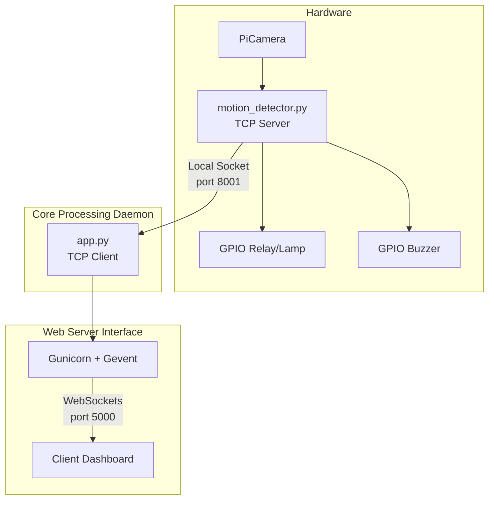

# 📷 Smart Narrow Alley Vision (IoT Edge Deployment)

**IoT Computer Vision Deployed on Linux Debian Bullseye (Raspberry Pi 3B+) using Background Subtraction Algorithm.**

Sistem keamanan dan *monitoring* pergerakan *real-time* yang dirancang khusus untuk lingkungan sempit (gang). Proyek ini menggunakan algoritma *Dual Region of Interest* (ROI) dengan arsitektur berbasis *Object-Oriented Programming* (OOP) di Python, dan di-*deploy* langsung pada *edge device* dengan integrasi layanan *background* Linux.

## 🏗️ System Architecture

Sistem memisahkan beban kerja antara pemrosesan sensor (Core) dan antarmuka pengguna (Web) menggunakan komunikasi **TCP/IP Socket** secara *asynchronous*.

✨ Key Engineering Features
💻 Software Development (Dev)
Object-Oriented Architecture: Penggunaan class (DualROIDetector, FlaskWebInterface) untuk enkapsulasi logika, state management, dan kode yang modular.

Non-Blocking Logic: Implementasi IPC (Inter-Process Communication) via internal TCP API agar pemrosesan Computer Vision yang berat tidak membuat antarmuka web freeze.

Lightweight Computer Vision: Menggunakan algoritma ROI dan Background Subtraction (cv2.createBackgroundSubtractorMOG2) yang sangat ringan dan dioptimalkan untuk perangkat keras dengan RAM & CPU terbatas (Raspberry Pi 3B+).

🐧 System Administration & Networking (Ops / Edge Deployment)
Linux Daemon Management: Menggunakan systemd (motion-detector.service) untuk auto-start, isolasi proses virtual environment, dan auto-restart jika terjadi crash (High Availability).

Production Web Server: Deployment Flask menggunakan Gunicorn dengan worker class geventwebsocket, dieksekusi via rc.local untuk menangani traffic secara stabil.

Separation of Concerns: Pemisahan konfigurasi statis (config.py) dengan logika utama untuk memudahkan maintenance tanpa harus mengedit core script.

🛠️ Tech Stack & Environment
Language: Python 3, JavaScript (ES6), HTML/CSS

Computer Vision: OpenCV (cv2)

Web & Networking: Flask, Flask-SocketIO, Gunicorn, TCP Sockets

Hardware & OS: Raspberry Pi 3B+, Linux Debian Bullseye (Raspberry Pi OS), RPi.GPIO

📂 Project Structure
src/ - Berisi logika utama (app.py, motion_detector.py, config.py)

templates/ - Berisi antarmuka web (dashboard.html)

deployment/ - Berisi konfigurasi server Linux (motion-detector.service, rc.local)
